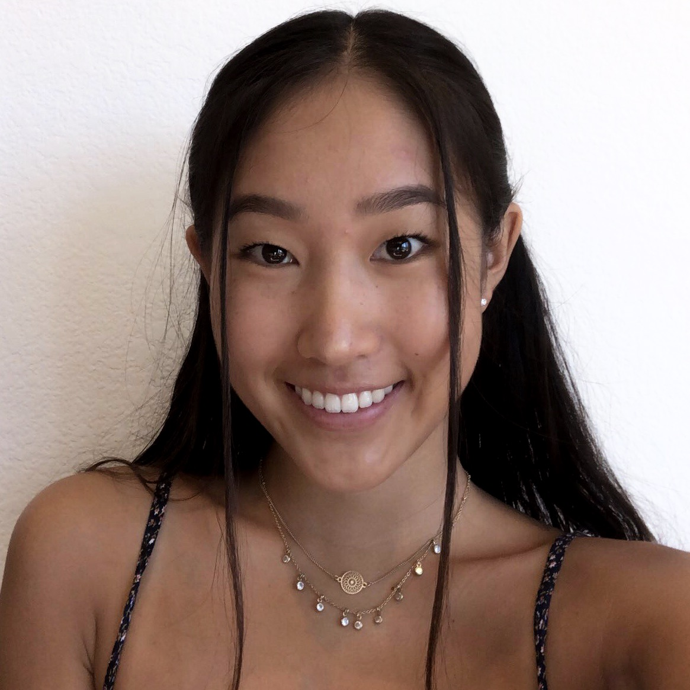

# Elisa Brooks

## Who am I?

### As a person
I'm a second year student at the **Univeristy of California, San Diego** *(UCSD)* pursuing a **_Computer Science_, BS** degree and possibly a minor in ***Business***. I was born in *Boston, MA* but lived in *San Diego, CA* for most of my life. In my freetime, I like to cook, go to the beach and hang out with friends ~~unless they want to go hiking yuck~~. Although I'm only 20 and have many more years ahead of me, I like to thik of the quote:
> Here I am, I've come so far
> 
> -- <cite>Elsa from Frozen 2

### As a programmer
I'm looking for internships as well as other professional opportunities in the STEM field.

#### Education
1. University of California, San Diego
2. Mira Mesa High School
   
#### Experience
- UCSD Summer Program for Incoming Students
- Seasonal Nordstrom Logisitics Specialist
  
#### Projects
- [Light and Sound Memory Game](https://wholesale-fuzzy-oatmeal.glitch.me/)
- [Personal Portfolio](https://elisabrooksportfolio.web.app/)
- BLM ChatBot 
- [Music Service Provider](https://tyty-music.web.app/)
  
#### Coursework (in progress & completed)
- [x] **CSE 100** Advanced Data Structures
- [ ] **CSE 101** Algorithms and Theory
- [x] **CSE 105** Theory of Computability
- [ ] **CSE 110** Software Engineering
- [x] **CSE 140** Digital Systems
- [x] **CSE 134B** Web Client Languagesg

#### This Lab
For this lab I used many git commands and learned some new ones such as: `git branch` and `git checkout`. I also created a [readme file](README.md) that has my favorite programming language as well as the link to this page. 